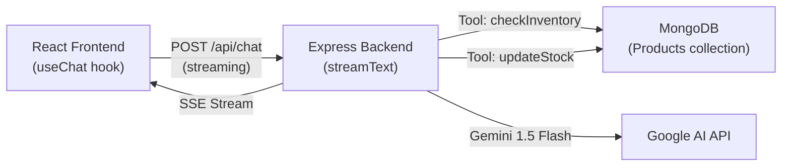

# 🤖 AI Chatbot Implementation Summary

## Architecture Overview

## Files Created / Modified

### Backend (`inventory-server`)

| File | Action | Purpose |
|------|--------|---------|
| [chat.js](file:///d:/Inventory-react/inventory-server/routes/chat.js) | **Created** | AI chat route with `streamText`, two tools (`checkInventory`, `updateStock`) |
| [index.js](file:///d:/Inventory-react/inventory-server/index.js) | **Modified** | Registered chat route at `/api` prefix |
| [.env](file:///d:/Inventory-react/inventory-server/.env) | **Modified** | Added `GOOGLE_GENERATIVE_AI_API_KEY` placeholder |
| `package.json` | **Updated** | Installed `ai`, `@ai-sdk/google`, `zod` |

### Frontend (`inventory-react`)

| File | Action | Purpose |
|------|--------|---------|
| [ChatPage.jsx](file:///d:/Inventory-react/inventory-react/src/components/Chat/ChatPage.jsx) | **Created** | Full chat UI with `useChat` hook, tool rendering, typing indicators |
| [ChatPage.css](file:///d:/Inventory-react/inventory-react/src/components/Chat/ChatPage.css) | **Created** | Premium glassmorphic styling with animations |
| [routes.js](file:///d:/Inventory-react/inventory-react/src/routes/routes.js) | **Modified** | Added `/ai-chat` route |
| [Sidebar.jsx](file:///d:/Inventory-react/inventory-react/src/components/sidebar/Sidebar.jsx) | **Modified** | Added "AI Tools" section with chat link |
| `package.json` | **Updated** | Installed `ai`, `@ai-sdk/react` |

## AI Tools Implemented

### `checkInventory`
- **Input**: `searchQuery` (string, Zod-validated)
- **Action**: Regex search across `name` and `sku` fields in the Products collection
- **Returns**: Matching products with name, sku, quantity, price, status, category, warehouse, supplier

### `updateStock`
- **Input**: `sku` (string), `newStockCount` (non-negative integer)
- **Action**: `findOneAndUpdate` on Products collection, auto-calculates status:
  - `0` → `out-of-stock`
  - `1-10` → `low-stock`
  - `11+` → `in-stock`
- **Returns**: Updated product details with new quantity and status

---

> [!IMPORTANT]
> ## Before Running
> 1. Replace `YOUR_GOOGLE_AI_API_KEY_HERE` in `inventory-server/.env` with your actual [Google AI Studio API key](https://aistudio.google.com/apikey)
> 2. Restart the backend server: `nodemon start` in `inventory-server/`
> 3. Navigate to **AI Chat** in the sidebar or visit `http://localhost:5173/ai-chat`

> [!TIP]
> The chat supports multi-step tool execution (`maxSteps: 5`), so the AI can search for a product and then update its stock in a single conversation turn.
